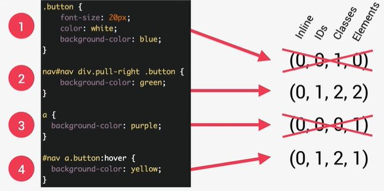

# Three Pillars to write good Html and CSS

## Responsive design

- Fluid layouts
- Media queries
- Responsive images
- Correct units
- Desktop first vs mobile first

## Maintainable and scalable code

- Clean
- Easy to understand
- Growth
- Reusable
- How to organize files
- How to name classes
- How to structure html

## Web Performance

- Less HTTP requests
- Less Code
- Compress Code
- Use a CSS preprocessor
- Less images
- compress images

## Specificity

1.  `Important`
1.  inline styles
1.  ids
1.  classes, pseudo-classes, attributes
1.  Elements, pseudo-elements
1.  source order

- Css declerations marked with !important have the highest priority
- inline styles will always have priority over styles in external stylesheets
- selector that contains 1 Id is more specific than one with 1000 classes.
- selector that contains 1 class is more specific than one with 1000 elements
- universal selector has no specificity
- rely on specificity than on the order of selectors



```CSS
#nav div.pull-right a.button{}
#nav a.button:hover{} /*pseudo classes are considered classes,this has a lower specificity than the above line, so this styling will not work even if we hover*/
/*its very important to have a consistent selectors*/
```

- percentage and relative values are always converted to pixels
- Each property has an initial value, used if nothing is declared
- Browser specify a `root font-size` for each page (16px)
- Percentages are measured relative to their `parent's font-size`, if used to specify `font-size`.
- Percentages are measured relative to their `parent's width`, if used to specify `lengths`.
- em are measured relative to their `parent font-size`, if used to specify `font-size`
- em are measure relative to their `current font-size`, if used to specify `lengths`
- rem are always measured relative to the `document's root font-size`
- vh and vw are simply percentage measurements of the viewport's height and width.

## inheritance

- when there are no specified value for a certain property, the brower will try to inherit this property if it is inherited
- Properties related to text are inherited: font-family, font-size,color etc..
- the computed value of a property is what gets inherited, not the declared value.
- the `inherit` keyword forces inheritance on a certain property
- the `initial` keyword resets a property to its initial value
